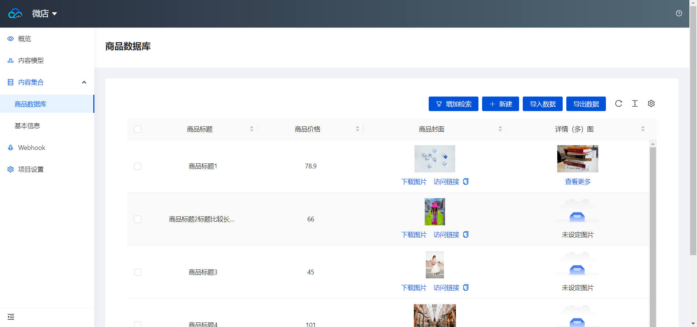
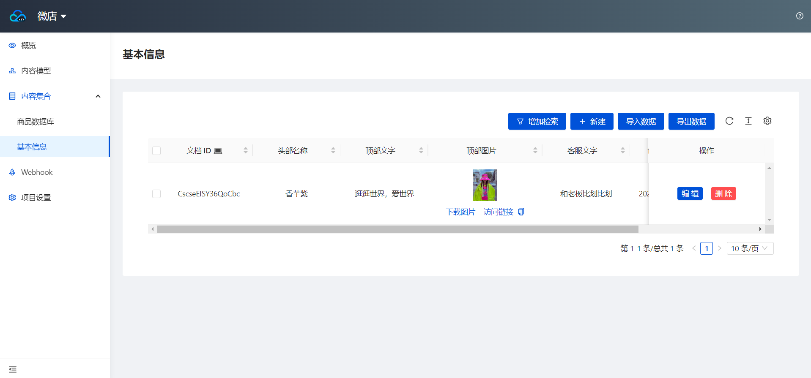

# ministore
微信小程序-基础与云开发-商品展示

### 效果-视频

[B站](https://www.bilibili.com/video/BV1434y1T7xF/)

### 开发基础

内容仅包含一些基础的组件，以及简单的云环境数据库查询，内容管理采用云环境的CMS（内容管理系统）

页面的一些基础内容可以在CMS中更改，包括首页页面标题、商品顶部的文字、联系客服的文字

### 内容管理

网页截图

1. 
2. 
